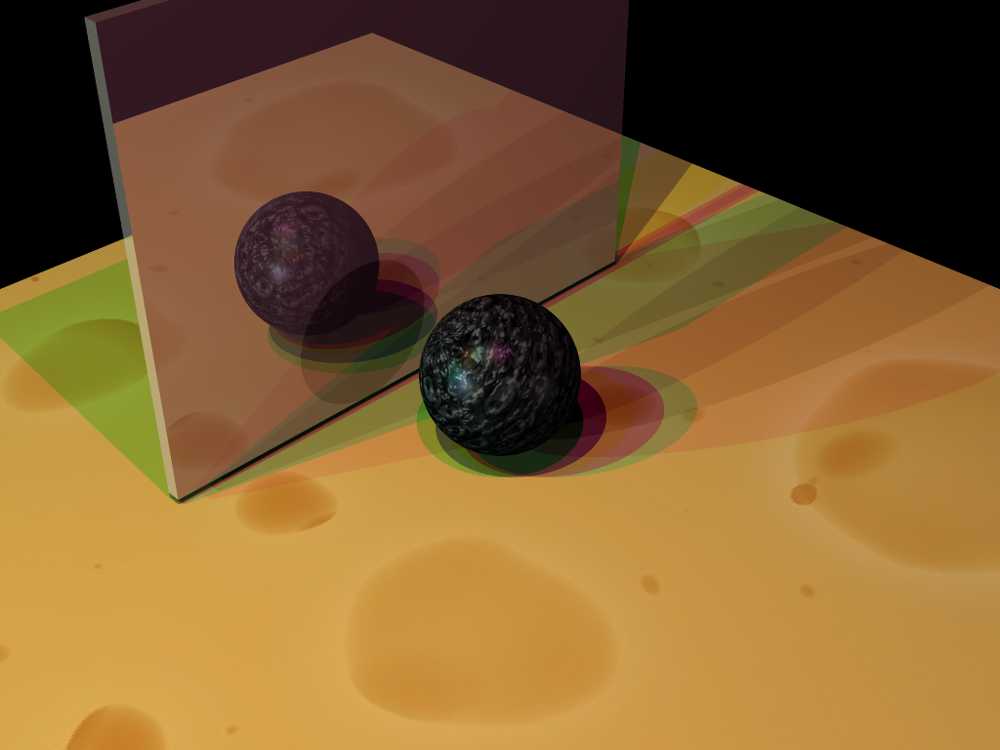

# Ray Tracer

A recursive ray tracer written in C++ supporting Phong illumination, shadows, reflections, and textures.

  
  

See `outputs/` for more rendered images

## Code Design Choices

### Class design
I organized my code into logical classes representing the different conceptual objects involved in the ray tracing pipeline. The core ray tracing code lives in the RayTracer class and is invoked in main.cpp. The most important classes I created were
  * **Primitives**: I chose to represent each implicit shape as a child of a base Primitive class. The base class contains concrete methods that all children inherit such as methods for applying a shape's CTM, math utils (e.g. quadratic solver), and basic getters. There are also two crucial abstract methods that all derived shapes must override: one for calculating the point of intersection and another for computing normals. This seemed logical because each primitive is represented by a different implicit equation, so the individual primitives should be responsible for calculating intersections/normals. Note that all Primitives are initialized and stored in a list in RayTraceScene.
  * **Ray**: this class represents a static ray in some space (e.g. camera/object/world space); once the ray has been constructed in a certain space (determined by the origin position and direction position passed to the constructor), it is fixed in that space. The reasoning behind this was to reduce the likelihood of space confusion by forcing functions that use Ray to be explicit in naming it. This class importantly saves the intersection point (t) if one exists. I decided to do this because the raytracer only cares about the closest ray-object intersection to the camera, so each ray can be associated with exactly one intersection point. 
  * **Camera**: Although most of the raw camera data is loaded into a SceneCameraData struct during scene parsing, I chose to make a proxy class that is easier to interface with. Importantly, this class computes and stores the camera's transformation & view matrices.
  * **Lights**: This is a light type-aware class whose methods behave differently depending on the type of light it is instantiated as (supports point, directional, and spot lights). The class importantly contains methods for getting the color of a light or the direction to the light, both functions of a query positions. This way, I had the necessary information to support the position-dependent color of spot lights and the position-dependent direction toward both spot and point lights. These methods are used in the Phong lighting stage of the pipeline.
  * **Texture**: to avoid uneccessarily loading identical textures into memory, I created a Texture class that stores a unique texture image. Each Primitive has a reference to exactly one Texture which it can use to compute texture colors. To keep track of which textures have already been loaded, I used a dictionary that maps file names to Textures. This dictionary is populated when building the scene in RayTraceScene. While code for texturing exists in the Texture class, code for surface parametrization (UV mapping) exists in each Primitive, as each maps XYZ points to the UV space differently.
  
### Scene Parsing
The input to the entire program is a XML scenefile which describes a scene in graph form, and the output is a rendered image of the scene. Before casting rays into the scene, the XML scenefiles are first parsed in the SceneParser to build an unordered list of primitives and their corresponding cumulative transformation matrix. This list of primitives is used as input to the ray tracer.

### Intersection pipeline
All rays store no intersection in the beginning (i.e. their intersection time is set to infinity). When using the implicit equations to check for intersections, I only considered the smallest non-negative t for each ray. If no intersections exist, then the ray's stored intersection point remains infinity. When iterating over all primitives for a single ray in traceRay(), I updated the best/nearest intersected primitive using a temporary variable whenever a closer intersection was detected. After checking for intersections, I applied Phong lighting at the world space intersection point.
### Reflections
I recursively called my traceRay function when computing lighting to accumulate the contribution of light onto reflective surfaces. This required modifying traceRay to handle recursion up to a maximum recursion depth. I made sure to avoid self-reflection by translating the newly spawned ray's origin slightly in the direction of reflection.
### Shadows
To determine visibility, I again used traceRay to shoot rays from intersection positions toward light sources, ignoring the contribution of occluded lights. These shadow rays, unlike reflection rays, do not recursively spawn additional reflection rays. Similar to reflection rays, I made sure to avoid self-shadowing.

## Running the Code

1. Clone the repo and open the project in QtCreator with Qt 5.9.7 (QMake 3.1) by selecting the CMakeLists.txt in the root directory.
2. Build the project using the default Qt configuration
3. Modify the `config.ini` file in the root directory so that the first two variables are the absolute path to the desired scenefile (all located in `scenefiles/xml/<scenefile_name>.xml` and the absolute path to the output file, respectively:

4. Under the "Projects" tab, make sure that the working directory is the absolute path to the root directory of the cloned repo and that the config.ini file is passed as a command line argument. 

5. Run the program. The rendered image will be saved in `outputs/<xml_scenefile_name>.png`. 
    * This can take up to 15 seconds depending on the complexity of the rendered scene. Run the program in release mode for faster rendering
